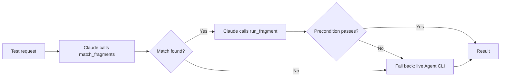
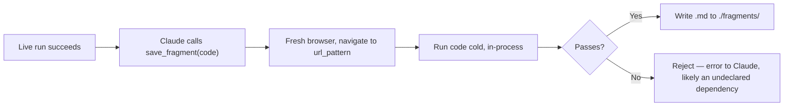
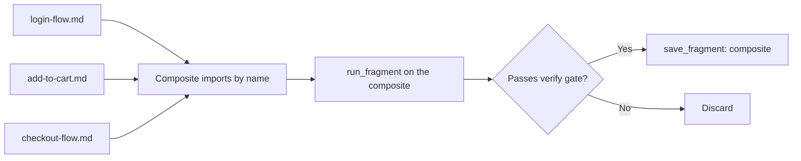

# Contribute

## Idea

*Re-build some Playwright artifacts (script + semantics) that are flexible (allow arguments, ...), reusable, and assemblable.*

*We can assemble them to become a bigger script.*

*Only fall back to the agent + Playwright Agent CLI (not MCP — Claude Code has shell access, Agent CLI does the same job for ~4x less cost) when there's nothing to reuse.*

*Before accumulating a script into the reusable store, confirm it actually worked — not just that it ran once. A flaky or lucky single run shouldn't pollute the library.*

*After manual work + experiments, do the lesson-learned step: generate something reusable for the next test, and accumulate it in a central place. At minimum, it must be reusable for the next turn of the same test.*

*Use scripts instead of manual work — it reduces cost and speeds things up.*

*The `./sessions/` folder, with all its previous executions, is a gold mine. We must find a way to reuse its history — the intermediate outputs, the lessons learned, the generated scripts, etc.*

## Questions

- What is the reusable thing, and in what form?
- How do we accumulate them?
- How do we avoid fragment overhead while still keeping it reusable?
- How do we deal with tribal knowledge, task-specific requirements, and app scope?
- For regression tests, how (and whether) do we assemble fragments into a larger, full test script?

## Suggestions

**In-process, not a separate server.** The three fragment tools run inside open-test's own main process — defined with the Agent SDK's `createSdkMcpServer()`/`tool()` helpers, attached via `options.mcpServers` on the session's streaming `query()` connection (see `design.md`). There's no separate package, no subprocess, no `.mcp.json` entry, and no independent crash-lifecycle to manage. A config flag controls whether they're attached at all: turn it off, and Claude falls back to live Playwright Agent CLI execution every time, as if fragments never existed.

Each fragment is one markdown file: YAML frontmatter for matching and params, prose explaining intent, and one JS code fence with the actual execution.

````markdown
---
name: login-flow
description: Logs into example.com
scope: specific
url_pattern: "https://example.com/login*"
tags: [auth]
params:
  - name: username
    type: string
    required: true
    description: Login email or username
  - name: password
    type: string
    required: true
    description: Account password
  - name: remember_me
    type: boolean
    required: false
    default: false
    description: Whether to check "remember me"
verified_at: 2026-07-01
use_count: 0
last_used_at: null
consecutive_failures: 0
---

Use this when a test needs to be logged in first.

```js
export async function run(page, { username, password, remember_me = false }) {
  await expect(page).toHaveURL(/login/)   // precondition — fails fast if stale
  await page.fill('#username', username)
  await page.fill('#password', password)
  if (remember_me) await page.check('#remember-me')
  await page.click('#submit')
}
```
````

Each part of the file plays a different role. The frontmatter is what `match_fragments` filters and ranks on, with no LLM involved, and it also defines the fragment's parameter contract. The prose is what Claude reads to decide which fragment, among the shortlist, actually fits. The code fence is shown to Claude too, before it picks one — this is cheap, since input tokens cost roughly 5x less than output, so showing the code costs little next to what this whole scheme exists to avoid: live, per-action agent round trips. Once Claude picks a fragment, its code is extracted into a real `.js` file on demand, cached by content hash, so `run_fragment` can execute it.

**Three tools, defined with `tool()` and bundled into one `createSdkMcpServer({ name: 'fragments', tools: [...] })`:**

| Tool | What it does | Design notes |
|---|---|---|
| `match_fragments(url, tags?)` | Filters candidates by URL and tags, ranks them by `use_count`/`last_used_at`, and returns a capped shortlist (about 5-10) with each candidate's description and code. | The filtering and ranking are deterministic, with no LLM involved. Picking one from the shortlist is Claude's own call, based on reading each candidate's description and code. |
| `run_fragment(name, args)` | Extracts the cached `.js` file by content hash, executes it, and returns the result. | A failed run increments `consecutive_failures`; a successful one resets that counter and bumps `use_count`/`last_used_at`. It runs in-process, in the same event loop as the app, so there are no cross-process races to worry about. |
| `save_fragment(name, description, scope, url_pattern, tags, params, code)` | Opens a fresh browser, navigates to `url_pattern`, and runs the code once from a cold start — nothing carried over from whatever Claude was doing when it found this flow. It only writes the `.md` file if that cold run passes; otherwise it rejects the save. | This is a mechanical check, not a hope that Claude followed the skill correctly. It also catches a fragment that only works because some *other*, undeclared fragment happened to run first — a cold start correctly rejects that case. If a fragment's dependency changes (its content hash changes), every fragment that imports it is marked `needs_reverification`. |

**Three skills that use them:**

| Skill | What it does |
|---|---|
| `fragment-lookup` | Before driving a test live, it calls `match_fragments` first; if something fits, it runs that fragment instead. |
| `fragment-learn` | After a live run succeeds, it calls `save_fragment` with what just happened — the tool verifies the result before persisting it, so Claude doesn't have to. |
| `fragment-combine` | It runs each relevant fragment in sequence with `run_fragment`; if the whole sequence passes, it also saves the composite as a new fragment. |

All `run_fragment` calls in a session — whether for a single fragment or a composite — share one browser context. That context is just a variable held in the app's own process now, so there's no IPC boundary to cross between calls. If an attempt is discarded or fails, the app closes and reopens that context before the next call, so stale partial state never leaks into what comes next.

The live Agent CLI fallback runs in a *different* process and does **not** share that context: if any step fails, the app discards the attempt and runs the whole thing live from scratch. That's only safe for idempotent/read-heavy flows — for flows with real side effects, restarting from scratch runs into the same clean-state/test-data gap noted below.

Main workflow (per turn):



Write path (how a fragment gets accumulated):



**Avoid overhead:**
- Only turn recurring steps into fragments — one-off actions aren't worth the overhead.
- Track `consecutive_failures` and retire a fragment after 3 in a row, until it's re-verified.
- Keep the shortlist ranked by `use_count`/`last_used_at` and capped — this is what keeps per-turn cost flat as the library grows.
- Before saving a new fragment, check for an existing near-match and update that one instead of creating a duplicate.

**App scope:**
- A `scope: specific` fragment targets one app with a precise `url_pattern`, so it's allowed to use brittle CSS selectors.
- A `scope: common` fragment has a broad or empty `url_pattern` and is matched by tags instead — it must use role-based selectors so it generalizes across apps.
- When both match, specific always outranks common.

**Assembling for regression:**
- The import convention `import { run as login } from 'fragment:login-flow'` uses the `fragment:` specifier to tell the in-process extractor to resolve by fragment name, not by file path.
- `fragment-combine` runs the sequence live first, sharing the browser context described above, then saves the composite with `save_fragment` once it passes — the same verify gate as any other fragment.
- Composites that get run often graduate to `@playwright/test`, which brings free trace.zip files, retries, and parallel runs.



## Self-review

- The first turn costs about twice as much, since it pays for both the live run and the cold re-run inside `save_fragment` (including that run's own browser launch). It breaks even on the second reuse.
- There's no separate process to crash independently anymore — a bug in a tool handler just shows up to Claude as a failed tool call, not as a process it's lost access to. The trade-off is that tool handlers now share the app's own event loop: a slow one, like `save_fragment`'s browser launch, has to stay async and non-blocking, or it competes with the Electron UI for the same process.
- This is controlled by a config flag, not a plugin directory: the app either attaches the fragment tools to `options.mcpServers`, or it doesn't. With the flag off, the app is still a fully working baseline — same principle as before, just a different mechanism for turning it off.
- To avoid turn 1 being 100% live, we ship a pre-verified starter pack of `common` fragments (cookie banners, pagination, etc.). It's committed to the repo, since it's product content, not user data.
- One open gap: there's no clean-state/test-data reset yet. This is deferred for now; the partial stopgap is letting precondition checks assert broader state, not just the URL. Two things depend on this gap eventually closing: the precondition-assertion stopgap itself, and the live fallback's "restart from scratch" approach (above) for any flow with real side effects.
- Another gap: a composite silently trusts a dependency even after that dependency changes. The fix is to mark it `needs_reverification` whenever a fragment's content hash changes.
- Concurrent writes can also corrupt a fragment file. The fix is to write to a temp file first, then rename it into place.
- `consecutive_failures` can't tell "the app changed" apart from "it flaked once" either. The fix is the same `needs_reverification` recheck: reset the counter on a pass, retire the fragment on a repeat failure.
- A fragment that fails at run time falls back to live execution in the same turn.
- `common` fragments will fail more often than `specific` ones. That's acceptable, since failures are caught rather than silent, and the retirement mechanism self-corrects for it.
- Code shown to the agent is a cheap sanity check, not proof: reading `page.click('#submit')` can't tell you `#submit` still exists on today's live page. That's still only provable by running it — the precondition assert and `save_fragment`'s cold-run gate remain the real verification, code-reading doesn't replace them.
