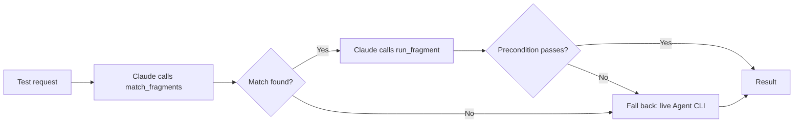
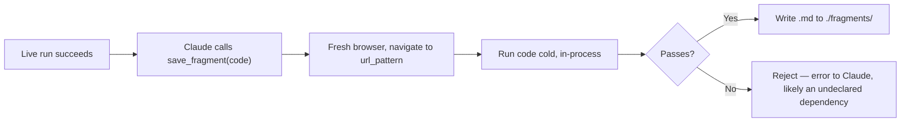
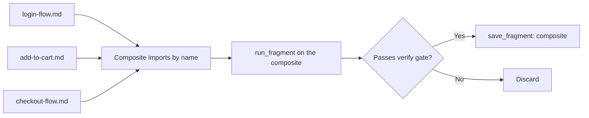

# Contribute

## Idea

*Re-build some Playwright artifacts (script + semantics) that are flexible (allow arguments, ...), reusable, and assemblable.*

*We can assemble them to become a bigger script.*

*Only fall back to the agent + Playwright Agent CLI (not MCP — Claude Code has shell access, Agent CLI does the same job for ~4x less cost) when there's nothing to reuse.*

*Before accumulating a script into the reusable store, confirm it actually worked — not just that it ran once. A flaky or lucky single run shouldn't pollute the library.*

*After manual work + experiments, do the lesson-learned step: generate something reusable for the next test, and accumulate it in a central place. At minimum, it must be reusable for the next turn of the same test.*

*Use scripts instead of manual work — it reduces cost and speeds things up.*

*The `./sessions/` folder, with all its previous executions, is a gold mine. We must find a way to reuse its history — the intermediate outputs, the lessons learned, the generated scripts, etc.*

## Questions

- What is the reusable thing, and in what form?
- How do we accumulate them?
- How do we avoid fragment overhead while still keeping it reusable?
- How do we deal with tribal knowledge, task-specific requirements, and app scope?
- For regression tests, how (and whether) do we assemble fragments into a larger, full test script?

## Suggestions

**In-process, not a separate server.** The three fragment tools run inside open-test's own main process — defined with the Agent SDK's `createSdkMcpServer()`/`tool()` helpers, attached via `options.mcpServers` on the session's streaming `query()` connection (see `design.md`). No separate package, no subprocess, no `.mcp.json` entry, no independent crash-lifecycle. A config flag controls whether they're attached at all — off, and Claude falls back to live Playwright Agent CLI execution every time, same as if fragments never existed.

One markdown file per fragment: YAML frontmatter (matching + params), prose (intent), one JS code fence (execution).

````markdown
---
name: login-flow
description: Logs into example.com
scope: specific
url_pattern: "https://example.com/login*"
tags: [auth]
params:
  - name: username
    type: string
    required: true
    description: Login email or username
  - name: password
    type: string
    required: true
    description: Account password
  - name: remember_me
    type: boolean
    required: false
    default: false
    description: Whether to check "remember me"
verified_at: 2026-07-01
use_count: 0
last_used_at: null
consecutive_failures: 0
---

Use this when a test needs to be logged in first.

```js
export async function run(page, { username, password, remember_me = false }) {
  await expect(page).toHaveURL(/login/)   // precondition — fails fast if stale
  await page.fill('#username', username)
  await page.fill('#password', password)
  if (remember_me) await page.check('#remember-me')
  await page.click('#submit')
}
```
````

- Frontmatter → filter, no LLM. Also the param contract.
- Prose → agent reads it, picks among the shortlist.
- Code → agent reads it too, before picking. Cheap: input tokens run ~5x cheaper than output, so showing it costs little next to what this whole scheme actually avoids — live, per-action agent round trips. Then extracted to a real `.js` file on demand, cached by content hash, for `run_fragment` to execute.

**Three tools, defined with `tool()`, bundled into one `createSdkMcpServer({ name: 'fragments', tools: [...] })`:**

| Tool | Does | Owns |
|---|---|---|
| `match_fragments(url, tags?)` | Pre-filter + rank by `use_count`/`last_used_at` + hard-cap (~5-10), return each candidate's description and code | Filter/rank is deterministic, no LLM. Picking one from the shortlist is Claude's call, reading description + code. |
| `run_fragment(name, args)` | Extract cached `.js` (by content hash), execute, return result | On fail: increments `consecutive_failures`. On pass: resets it, bumps `use_count`/`last_used_at`. In-process — same event loop as the app, no cross-process races. |
| `save_fragment(name, description, scope, url_pattern, tags, params, code)` | Launches its own fresh browser, navigates to `url_pattern`, then runs `code` once — from a cold start, nothing carried over from Claude's discovery run. Fails → rejects the save. Passes → writes the `.md`. | Mechanical, not a hope Claude followed the skill. Also a soundness check: a fragment that only works right after some *other* undeclared fragment ran first isn't a reusable fragment — cold-start correctly rejects it. If a dependency's hash changed, marks every fragment that imports it `needs_reverification`. |

**Three skills that use them:**

| Skill | Strategy |
|---|---|
| `fragment-lookup` | Before driving a test live, call `match_fragments`; if something fits, `run_fragment` it instead |
| `fragment-learn` | After a live run succeeds, call `save_fragment` with what it did — the tool verifies before persisting, Claude doesn't have to |
| `fragment-combine` | `run_fragment` each relevant step in sequence; if the whole thing passes, `save_fragment` the composite too |

Browser state: `run_fragment` calls (atomic or composite) share one browser context per Claude Code session — now literally a variable held in the app's own process, no IPC boundary to cross. On any discarded/failed attempt, close and re-open that context before the next call, so stale partial state never leaks into what comes next.

The live Agent CLI fallback is a *different* process and does **not** share that context — if any step fails, discard the attempt and run the whole thing live from scratch. Only safe for idempotent/read-heavy flows. For flows with real side effects, "restart from scratch" hits the same still-open clean-state/test-data gap below.

Main workflow (per turn):



Write path (how a fragment gets accumulated):



**Avoid overhead:**
- Only fragment recurring steps, not one-offs.
- Track `consecutive_failures`; retire after 3 until re-verified.
- Rank shortlist by `use_count`/`last_used_at`, hard-cap it — this is what keeps per-turn cost flat as the library grows.
- Before writing, check for an existing near-match and update it instead of piling up duplicates.

**App scope:**
- `scope: specific` — precise `url_pattern`, one app, can use brittle CSS selectors.
- `scope: common` — broad/no `url_pattern`, matched by tags, must use role-based selectors to generalize.
- Specific always outranks common on a match.

**Assembling for regression:**
- Import convention: `import { run as login } from 'fragment:login-flow'` — the `fragment:` specifier tells the in-process extractor to resolve by fragment `name`, not a file path.
- `fragment-combine` tries the sequence live first (shared browser context, see above), then `save_fragment`s the composite once it passes — same verify gate as any other fragment.
- Frequently-run composites graduate to `@playwright/test` — free trace.zip, retries, parallel runs.



## Self-review

- Turn 1 costs ~2x (live run + the cold re-run inside `save_fragment`, including its own browser launch). Breaks even on the 2nd reuse.
- No separate process to crash independently anymore — a bug in a tool handler is just a failed tool call the SDK surfaces to Claude, not a process Claude loses access to. But it now shares the app's own event loop: a slow tool handler (e.g. `save_fragment`'s browser launch) must stay async and non-blocking, or it competes with the Electron UI for the same process.
- Config flag, not a plugin directory: attach the fragment tools to `options.mcpServers`, or don't. Off is still a fully working baseline — same principle as before, different mechanism.
- Fix: ship a pre-verified starter pack of `common` fragments (cookie banners, pagination, etc.) so turn 1 isn't 100% live. Committed to the repo — product content, not user data.
- Gap: no clean-state/test-data reset yet. Deferred; a partial stopgap is letting precondition checks assert broader state, not just the URL. Two things depend on this gap being closed eventually: the precondition-assertion stopgap itself, and the live-fallback's "restart from scratch" (above) for any flow with real side effects.
- Gap: a composite silently trusts a changed dependency. Fix: mark it `needs_reverification` when a fragment's content hash changes.
- Gap: concurrent writes can corrupt a fragment file. Fix: write to a temp file, then rename it in.
- Gap: `consecutive_failures` can't tell "app changed" from "flaked once." Fix: same `needs_reverification` recheck — reset on pass, retire on repeat fail.
- A fragment that fails at run time falls back to live execution in the same turn.
- `common` fragments will fail more than `specific` ones. Acceptable — failures are caught, not silent, and self-correct via retirement.
- Code shown to the agent is a cheap sanity check, not proof: reading `page.click('#submit')` can't tell you `#submit` still exists on today's live page. That's still only provable by running it — the precondition assert and `save_fragment`'s cold-run gate remain the real verification, code-reading doesn't replace them.
