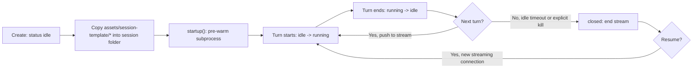
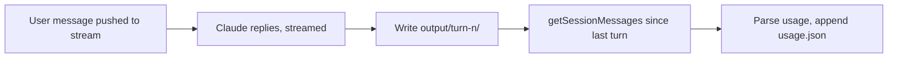

# Design

Stack: Bun, TypeScript, Electron, Playwright (Agent CLI for live execution; Library used in-process by the fragment tools; Test Framework available to Claude via Bash for graduated suites), Claude Agent SDK.

## Main components

| Component | Responsibility |
|---|---|
| Electron shell | Main process (Node/Bun) + renderer: two screens — Dashboard (sessions by status) and Session view (chat + artifacts) |
| Session manager | Create/resume/kill sessions, own the folder layout, bind `cwd`. Creating a session copies `assets/session-template/*` (`.claude/`, `CLAUDE.md`, `.mcp.json`) into it wholesale — Claude Code's own `cwd`-based discovery picks it all up, no custom wiring. Tracks status (`running`/`idle`/`closed`). |
| Agent runner | Wraps Claude Agent SDK `query()` in streaming-input mode — one persistent connection per session. When the fragment flag is on: merges the in-process fragment server into `options.mcpServers` — this can't live in the copied `.mcp.json`, since it's a JS object, not a file. Off, Claude just drives tests live every turn. |
| Fragment tools | In-process `createSdkMcpServer()` bundling `match_fragments`/`run_fragment`/`save_fragment` (see `contribute.md`) — reusable Playwright scripts, verified before caching. Strip the flag and the app behaves exactly as if this component didn't exist. |
| Usage tracker | Read turns via the SDK's `getSessionMessages()`, hand-parse each assistant message's `usage` object (the SDK leaves it untyped), compute cost, write `usage.json` |

## Code structure

```
open-test/
├── assets/
│   ├── session-template/   # committed: copied wholesale into <session>/ before spawning query() for that session
│   │   ├── .claude/
│   │   │   ├── skills/
│   │   │   │   ├── fragment-lookup/SKILL.md
│   │   │   │   ├── fragment-learn/SKILL.md
│   │   │   │   └── fragment-combine/SKILL.md
│   │   │   └── commands/   # room to grow; empty for now
│   │   ├── CLAUDE.md   # testing guardrails for sessions — NOT this repo's own /CLAUDE.md, a completely different thing with a completely different audience
│   │   └── .mcp.json   # real external servers only, e.g. mcp-server-paint — the in-process fragment server can't go here
│   └── starter-pack/   # committed: pre-verified common fragments, read-only
├── src/
│   ├── main/
│   │   ├── index.ts
│   │   ├── window.ts
│   │   └── ipc.ts   # contextBridge — streamed events, keyed by sessionId, independent of which renderer screen is mounted
│   ├── renderer/   # UI only, no Node/fs access
│   │   ├── App.tsx   # routes between the two screens below
│   │   ├── Dashboard.tsx   # screen 1: sessions grouped by status, new/resume/kill
│   │   ├── SessionView.tsx   # screen 2: ChatPane (left) + ArtifactView (right)
│   │   ├── ChatPane.tsx   # re-hydrates from main on mount, doesn't own state
│   │   └── ArtifactView.tsx   # watches output/turn-n/ (and input/), auto-refreshes
│   ├── core/   # pure, unit-testable — no fs/subprocess here
│   │   ├── session/
│   │   │   └── session.ts   # status transitions, idle-timeout gating
│   │   └── usage/
│   │       ├── parse.ts   # SessionMessage -> TurnUsage
│   │       └── pricing.ts   # model rate table
│   └── io/   # touches fs/subprocess — integration-tested, not unit
│       ├── claudeRunner.ts   # streaming query(); copies assets/session-template/* into <session>/ on creation; if the fragment flag is on, also merges fragments/server.ts into options.mcpServers
│       └── fragments/
│           ├── server.ts   # createSdkMcpServer() + the three tool() definitions
│           ├── store.ts   # read/write ./fragments/*.md, content-hash cache
│           └── browser.ts   # the one shared Playwright context per session
├── fragments/   # gitignored: user's local library
└── sessions/   # gitignored: session folders, each seeded from assets/session-template/ at creation time
```

## Core types

```ts
interface Session {
  sessionId: string        // folder-naming key; stable, not user-renamed
  claudeSessionId: string
  createdAt: string
  status: 'running' | 'idle' | 'closed'
  // running only ever returns to idle — never closes directly, so a turn in
  // progress can't be interrupted by the idle timeout. closed only reachable
  // from idle (timeout, or explicit kill which calls interrupt() first if a
  // turn was running). Resumable from closed via a fresh streaming
  // connection, options.resume: claudeSessionId.
  path: string              // absolute, == cwd for query(). Derived from root +
                            // sessionId, not itself persisted.
}

interface TurnUsage {
  turn: number
  startedAt: string
  endedAt: string
  model: string
  inputTokens: number
  outputTokens: number
  cacheReadTokens: number
  cacheWrite5mTokens: number
  cacheWrite1hTokens: number
  costUsd: number
  usedFragmentTool: boolean  // did this turn's transcript contain a
                             // run_fragment/save_fragment call — cheap to
                             // derive while parsing, otherwise unrecoverable
                             // later without re-scanning the transcript
}
```

The Dashboard's display name comes from the SDK's `renameSession(claudeSessionId, title)` / `SDKSessionInfo.customTitle`, fetched live via `listSessions()`/`getSessionInfo()` — not a field on `Session` itself.

```ts
interface FragmentMeta {
  name: string
  description: string
  scope: 'specific' | 'common'
  url_pattern: string
  tags: string[]
  params: FragmentParam[]
  verified_at: string
  use_count: number
  last_used_at: string | null
  consecutive_failures: number
}

interface FragmentParam {
  name: string
  type: 'string' | 'boolean' | 'number'
  required: boolean
  default?: string | boolean | number
  description: string
}
```

`FragmentMeta`/`FragmentParam` — the parsed shape of a fragment's YAML frontmatter (see `contribute.md`) — live in `io/fragments/store.ts`, not imported by `core/`. Field names stay snake_case, matching the on-disk YAML directly; no mapping layer, since Claude reads/writes that frontmatter as-is.

## Workflows

**Session lifecycle:**



Idle timeout only ever fires from `idle`. An explicit kill mid-turn calls `interrupt()` first (back to `idle`), then closes — so `closed` is always reached from `idle`, whether timer- or human-triggered. If the fragment flag is on, the in-process server merges into `options.mcpServers` at the same time as `startup()` — no separate lifecycle to track.

**Turn execution** (fragment tool calls, if any, happen invisibly inside the streamed reply — Claude decides, the app doesn't branch on it):



**Process boundary:**

```mermaid
flowchart LR
    R[Renderer: Session view] -->|IPC, streamed events| M["Main process (incl. fragment tools)"]
    M --> S[Session manager]
    S --> Q["Agent SDK query&#40;&#41;, streaming input"]
    Q <-->|"MCP tool calls, in-process"| N["claude binary — one subprocess per session"]
```



The only real process boundary above is `M` ↔ `N`. Fragment tools live inside `M` — there's nothing separate to crash or lose.

## Prerequisites

- Bun, TypeScript
- uv (for `mcp-server-paint`)
- Claude Agent SDK (`@anthropic-ai/claude-agent-sdk`) — brings the `claude` binary along; no separate CLI install

## Main dependencies

- `@anthropic-ai/claude-agent-sdk` — agent runner
- `electron` — desktop shell
- `playwright` — used directly, in-process, by the fragment tools
- `@playwright/test`, `@playwright/cli` — installed so Claude can drive live tests (Agent CLI) and write graduated suites via Bash; the app doesn't touch these two directly
- [mcp-server-paint](https://github.com/iteam1/mcp-server-paint) — screenshot annotation
